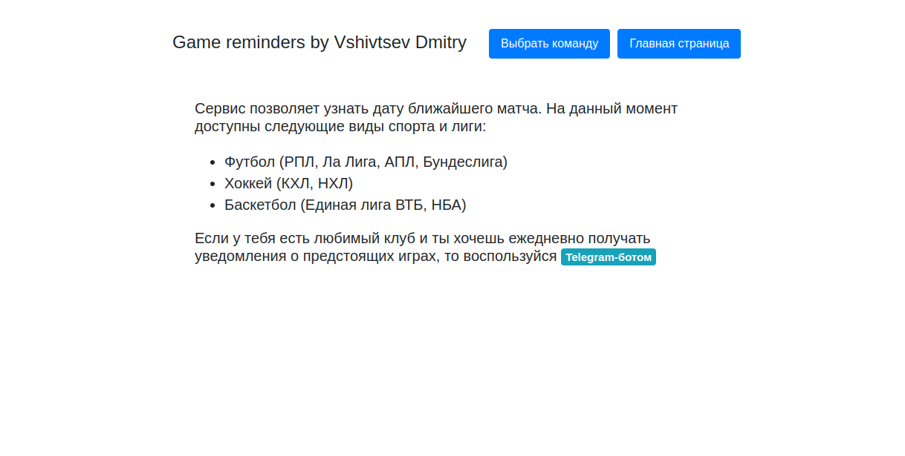
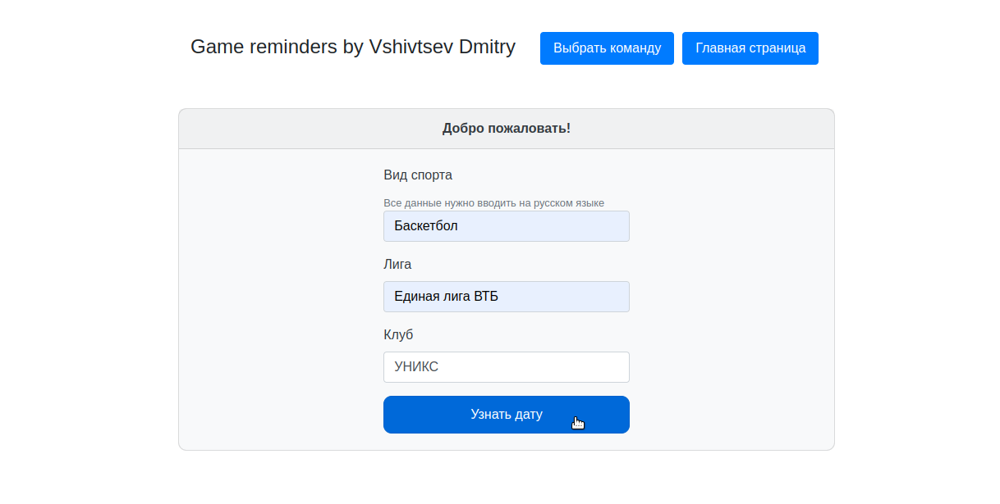
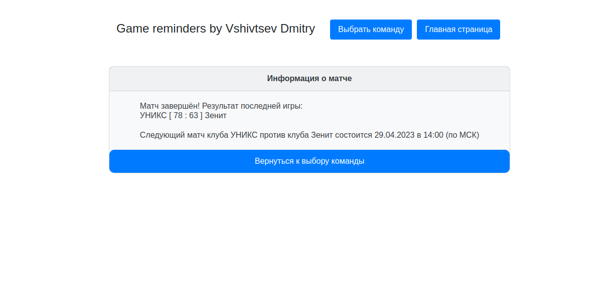

# GameReminders + FastAPI

This project has the functionality of the [GameRemindersBot](https://github.com/dmitryvshivtsev/GameRemindersBot) project, 
but displays information about upcoming matches on the site using FastAPI.

Demo: \
 \
 \

Tools:
* Python3.10
* FastAPI
* Jinja2
* SQLAlchemy
* PostgreSQL
* Requests + bs4

