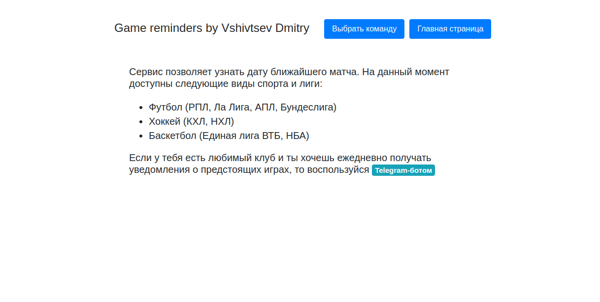
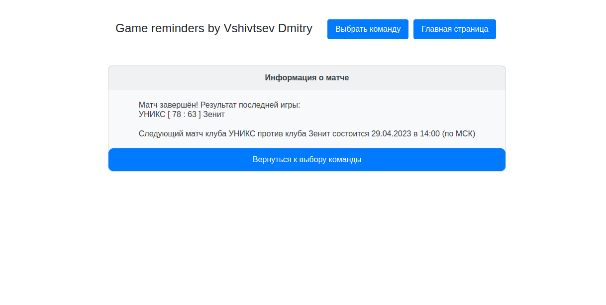

# GameReminders with FastAPI

Данный проект имеет функционал проекта GameRemindersBot, но отображает
информацию о предстоящих матчах на сайте с использованием FastAPI.

Demo: \
 \
 \

Инструменты:
* Python3.10
* FastAPI
* Jinja2
* SQLAlchemy
* PostgreSQL
* Запросы + bs4